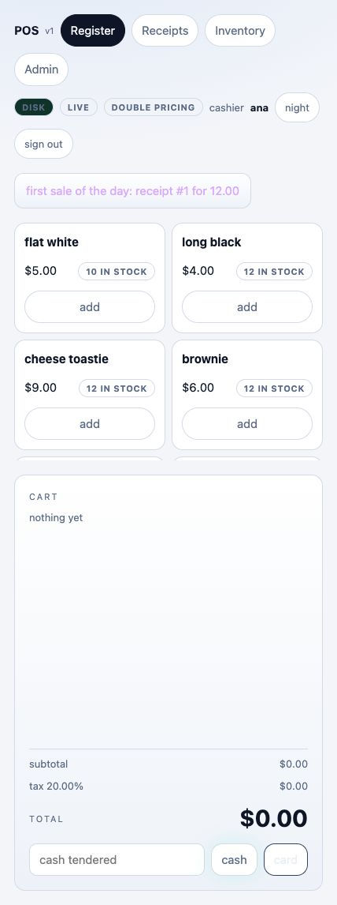

# LiveReload in the browser POS app — 2026-10-04

## Implemented boundary

`examples/pos1.fpr` is the existing browser POS: one model/register actor,
multiple websocket cashiers, client-local carts mirrored into server sessions,
stock and receipts reconstructed from an append-only shop log. It uses
`std/live`, not the terminal `std/mvu` runner.

`examples/pos1_pricing.fpr` now holds two exports:

- `rate : Int -> Int`: configured basis points -> effective basis points.
- `label : Unit -> String`: the visible policy label.

Ordinary `fpr run examples/pos1.fpr` uses the static policy. A supervised run
opens the published policy with the shared `std/livereload` binding helper:

```
fpr commit examples/pos1_pricing.fpr
POS1_PORT=6710 POS1_STORE=/tmp/pos-demo.log fpr watch examples/pos1.fpr --module pos1_pricing
# Another terminal, same workspace, after editing the pricing module:
fpr commit examples/pos1_pricing.fpr
```

Use a disposable receipt store to experiment with pricing. The active label is
shown beside the cashier. The cart's preview uses the effective rate and checkout
uses the same server-side calculation. The configured base rate remains in the
shop log; the policy transforms it. Existing receipts retain their committed
totals/taxes and are never recomputed during adoption or log rebuild.

The optional [FP-RISC reload toast](2026-10-04-RELOAD-NOTICE.md) is enabled with
`POS1_RELOAD_NOTICE=true`; it shows the adopted module/hash and UTC time for
three seconds without notification-specific JavaScript.

## Driver integration

The browser driver's existing `Every 300 PricingPoll` subscription checks the
ready-image journal. Only its internal sid-0 event can perform that poll/adoption;
client-originated `PricingPoll` messages are ignored. A poll delivers the newest
candidate's reified Reload identity to the shared attachment/binding gate inside
the single model writer, between checkout events. Rapid publications coalesce.

The runtime session (table/hash/cursor/functions) stays in the server model and
is excluded from browser projections and receipt lines. Successful adoption
replaces only this session. Cashiers, mirrored carts, catalog stock, accumulated
revenue and sale history stay in the same model. A changed policy label/rate
changes each session's data projection, so existing websocket writers paint the
new policy through their ordinary delta/structural-patch paths.

A refused image or binding retains the loaded session; its cursor advances so
that a bad publication is logged once. Later candidates are checked against the
actual loaded baseline, permitting recovery after an incompatible intermediate
version. Read/parse errors retain the cursor and retry. There is no extra watcher
actor to orphan: the subscription is owned by the existing browser driver.

## Executed verification

`tests/check_pos_reload.py` passed on one and four harts with two real websocket
register connections (v3 structural patches and a legacy snapshot client):

1. Sign in as two seeded demo cashiers and commit an initial $5.50 receipt.
2. Keep distinct mirrored carts pending on both connections.
3. Refuse an invalid source commit without changing the publication journal or receipts.
4. Commit compatible double-rate pricing while the POS process remains running.
5. Observe the new label/effective rate on both existing connections.
6. Checkout the retained carts without resending client state: $12.00 and $7.20,
   correctly attributed to the two original cashiers. The $5.50 receipt remains.
7. Refuse an explicit major version with an incompatible export type, then adopt
   a later compatible triple-rate version and checkout a $5.20 receipt.
8. Check the original sockets and process remain, rebuild stock from the receipt
   log, quit normally, and remove the supervisor's temporary executable.

A separate ordinary-run case passed without a publication journal: static policy,
sign-in, a $5.50 checkout and normal quit.

The suite uses the existing stdlib websocket test client and is registered in
`tests/check_base.py`; it adds no package dependency.

A separate actual browser UI session verified the normal page's client-local
cart behavior: sign in, add two flat whites ($10 subtotal, $11 total), commit the
double-rate policy without refreshing, observe the same cashier/cart with a
$12 total, and checkout. The receipt log contained total 1200, tax 200 and two
flat whites; displayed stock fell from 12 to 10. The supervisor logged exactly
one app launch. The isolated preview and temporary receipt store were cleaned up.



## Remaining scope

This verifies the actual POS app's dynamic pricing boundary, not automatic
replacement of arbitrary app functions or model layouts. Initial native export
bindings still rely on the explicit trusted binding declaration; generated typed
descriptors are separate compiler work. Receipt replay uses stored amounts;
policy-version audit metadata in sale lines is a future format/version change.
The targeted POS suite, native build, Python syntax and scoped whitespace checks
passed. The complete Base suite was not rerun for this POS-only change. QOS POS
migration/repinning and Linux execution are separate target validations.
