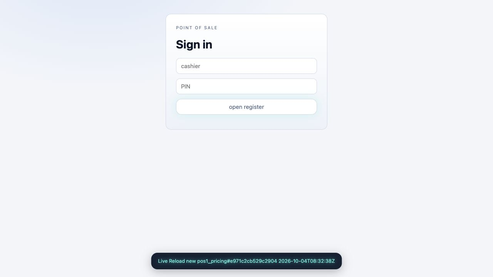

# Browser MVU live-reload notice

`std/livenotice` provides an opt-in transient status toast for `std/live` browser
apps. The state, clock formatting, expiry and view tree are FP-RISC. The existing
browser MVU client paints normal text deltas; no notification-specific JavaScript
or browser notification permission is required.

## Try the POS

```sh
./fpr commit examples/pos1_pricing.fpr
POS1_RELOAD_NOTICE=true POS1_STORE=/tmp/pos-notice.log ./fpr watch examples/pos1.fpr --module pos1_pricing
# Edit pricing, then commit from another terminal in the same workspace:
./fpr commit examples/pos1_pricing.fpr
```

Open the POS on localhost:6710. After a compatible new policy is adopted, all
connected pages briefly display:

```text
Live Reload new pos1_pricing#<adopted-hash> <YYYY-MM-DDTHH:MM:SSZ>
```

The option defaults to false. Ordinary direct runs also accept `--reload-notice`
or `--reload-notice=false`; the environment option works with the watch supervisor.
The notice lasts three seconds, expiring on the next 100 ms internal subscription
tick. It is also visible on the signed-out page. Startup attachment, a repeated
hash, invalid commits and refused reloads do not announce a successful adoption.

## Use in another browser MVU app

1. Import `Notice = use "std/livenotice"` and initialize model state with
   `Notice.init enabled 3000`. Keep it out of persistence.
2. After the reload gate **and** binding succeed, when the adopted hash differs
   from the currently loaded hash, set the state to
   `Notice.adopted moduleName adoptedHash model.notice`.
3. While `Notice.pending model.notice`, subscribe to `Live.Every 100 NoticeTick`.
   Handle that message only for internal sid 0 by setting the state to
   `Notice.tick model.notice`. Ignore external attempts to send the tick message.
4. Project `.text` into every session that should see the status. Include
   `Notice.view projectedText` in the view tree and append `Notice.css` to the
   app stylesheet. Reserve this node even when the text is empty.

The helper reports **adoption**, rather than merely observing a new publication.
Applications own that boundary, so it is explicit rather than inferred by the
browser transport. The same helper works with `serve`, `serveCached` and
`serveProjected`. This does not enable module loading in apps that lack a reload
integration.

Wall-clock UTC is read once at adoption for the text. Expiry uses monotonic
microseconds; changing the wall clock cannot extend or shorten it. A newer
adoption replaces both text and deadline. A delayed older tick checks the current
deadline and cannot clear a newer notice. Empty text hides the fixed-shape status
element via CSS. Its `role=status` and polite live region support accessibility;
the normal view renderer escapes module names/text.

## Verification

`tests/livenotice.fpr` exercises disabled/zero duration, UTC formatting, exact
deadline expiry, replacement before an older deadline, and stable view shape.
`tests/check_pos_reload.py` runs it, then checks enabled and default-disabled
real POS reloads with modern and legacy websocket clients on one and four harts.
It checks the adopted hash/timestamp, automatic expiry, internal-event ownership,
refusal without a success toast, recovery and retained checkout state. The suite
is part of `tests/check_base.py`.

An actual browser preview also displayed the toast on the signed-out POS page
and hid it automatically. Its temporary store, process and browser tab were
cleaned up. The complete Base suite and Linux/QOS targets were not rerun here.
An initial end-to-end run timed out waiting for POS shutdown after the notice
checks passed. Two complete repeat runs passed, including shutdown; the timeout
did not reproduce. No shared-driver shutdown fix is claimed by this change.


